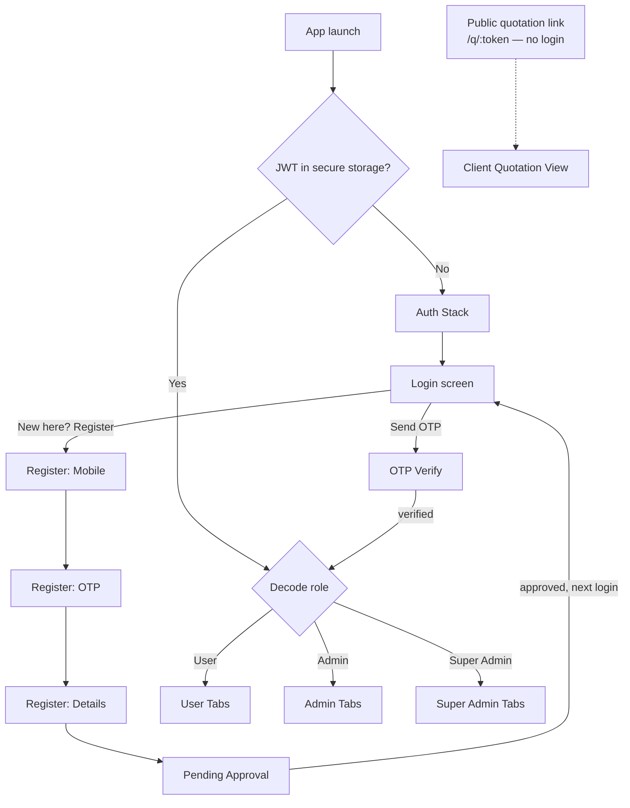
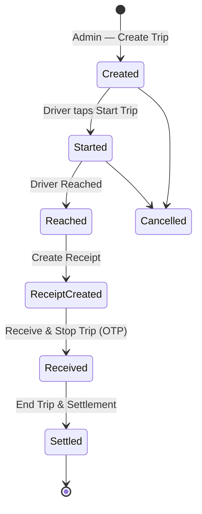
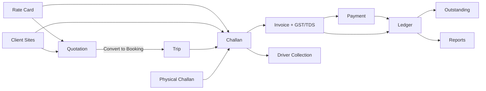

# MoveXpress — Frontend Project Flow

> Frontend-only build plan derived from `MoveXpress_Full_Implementation_Plan.pdf` (full-stack scope)
> and `Frontend_implementation.docx` (module-wise frontend breakdown, 88 days).
>
> **Scope of this document:** everything the frontend team builds — screens, navigation, data flow,
> folder structure, build order. No backend work. Every API in the PDF is consumed through a mock
> service layer so the UI is 100% demoable before a single endpoint exists.

---

## 0. Ground rules for a frontend-only build

| Decision | Choice | Why |
|---|---|---|
| Platform | React Native (Expo) + React Native Web | Mandated by PDF §A7 — one codebase → Android, iOS, Web |
| Navigation | React Navigation (native-stack + bottom-tabs) | Role-switched navigators, deep-linkable for the public quotation view |
| Server state | TanStack Query | Caching, loading/error states, retries — swaps mock→real with zero component changes |
| Client state | Zustand (`authStore`, `uiStore`) | Session, role, JWT, toast/modal state |
| Forms | React Hook Form + Zod | The app is ~70% forms; Zod schemas double as the API contract |
| Charts | Victory Native (mobile) / Recharts (web) via one `<Chart>` wrapper | PDF §B10 |
| Styling | Design tokens + `StyleSheet` (or NativeWind) | Pixel-consistent across web/mobile |
| **API layer** | `src/services/*.ts` → `apiClient` → **`USE_MOCKS` flag** | The single most important rule below |

### The mock-swap rule

```
Component → useQuery(['trips'])  →  tripService.list()  →  apiClient.get('/trips')
                                                              │
                                              USE_MOCKS=true ─┴─ mockAdapter → fixtures/trips.json (300ms delay)
                                              USE_MOCKS=false ─── real axios → https://api.movexpress...
```

No component ever imports a fixture. Flipping one env var turns the whole app live.
Endpoint paths and payload shapes are copied verbatim from the PDF's API lists (`POST /auth/send-otp`,
`POST /invoices/generate-from-challans`, `GET /customers/:id/ledger`, …) so the contract is frozen on day 1.

---

## 1. Top-level application flow



Three entry points total: **Auth Stack**, **role-based App Shell**, and one **public unauthenticated route**
(the client-facing quotation view from PDF §B3).

---

## 2. Navigation tree

```
RootNavigator
│
├── AuthStack                         (no session)
│   ├── LoginScreen
│   ├── OtpVerifyScreen               ← shared component, mode: 'login' | 'register'
│   ├── RegisterMobileScreen
│   ├── RegisterDetailsScreen
│   └── RegisterPendingScreen
│
├── PublicStack                       (deep link, no session)
│   └── QuotationPublicView           /q/:token
│
└── AppShell                          (session + role)
    │
    ├── UserTabs                      role = User
    │   ├── Dashboard
    │   ├── Trips        → TripDetails → StartTrip / EndTrip
    │   └── Account      → EditProfile, Logout
    │
    ├── AdminTabs                     role = Admin
    │   ├── Dashboard    → quick actions (Add Vehicle / Driver / Trip / Receipt)
    │   ├── Trips        → TripsList → CreateTrip → TripDetails → TripInProgress
    │   │                            → CreateReceipt → ReceiptPreview → ReceiveStopTrip(OTP)
    │   │                            → EndTripSettlement
    │   ├── Fleet        → VehiclesList → Add/Edit/Detail
    │   │                → DriversList  → Add/Edit/Detail
    │   ├── Billing      → Challans | Quotations | Invoices | Ledger | Collections | Reports
    │   └── More         → Notifications, Profile, Rate Card, Clients & Sites
    │
    └── SuperAdminTabs                role = Super Admin
        └── = AdminTabs + Masters (Rate Card Master, Companies, cross-company filter)
```

> **UX call:** the docx lists 7 bottom tabs for Admin (Dashboard/Vehicle/Driver/Receipt/Trip/Notifications/Account).
> Seven tabs is unusable on a 375px screen. Collapsed to **5 tabs + a "More" hub**; every screen from the docx
> still exists and is reachable in ≤2 taps. Web renders the same tree as a left sidebar.
>
> **Super Admin is not a separate build.** Per PDF §A5 it's Admin screens + a permission layer. Frontend implements
> one `<RoleGate role="SuperAdmin">` wrapper and a `companyId` filter that Super Admin can clear. Zero duplicated screens.

---

## 3. Screen inventory (74 screens)

### A1 · Login — 8 days
| # | Screen | Key states |
|---|---|---|
| 1 | Login | idle / validating / sending / error (invalid number, API down) |
| 2 | OTP Verify | 6-box auto-focus, auto-advance, backspace, paste, 30–60s resend timer, invalid-OTP shake |
| — | Role redirect resolver | reads role from verified session → routes to correct tab set |

### A2 · Registration — 6 days
| # | Screen |
|---|---|
| 3 | Register — Mobile (step 1/4) |
| 4 | Register — OTP (step 2/4, reuses screen #2) |
| 5 | Register — Details: First, Last, Company, City (step 3/4) |
| 6 | Pending Approval: "review in progress · within 24 hrs · notified by SMS/Email" (step 4/4) |

Step-progress bar, back navigation, and form state persisted across all four steps.

### A3–A5 · User + Admin + Super Admin — 32 days (the core)
**User (3):** 7 Dashboard · 8 Trips List (Upcoming/Completed/Cancelled tabs) · 9 Trip Details (+Start/End Trip) · 10 Account · 11 Edit Profile

**Admin dashboard & fleet (12):** 12 Admin Dashboard (trip overview, fleet donut, driver donut, 4 quick actions) ·
13 Vehicles List (search+filter) · 14 Add Vehicle (basic + technical + image upload) · 15 Edit Vehicle · 16 Vehicle Detail ·
17 Drivers List · 18 Add Driver (personal + license + emergency contact) · 19 Edit Driver · 20 Driver Detail

**Trip lifecycle (8):** 21 Trips List (Upcoming/In Progress/Completed) · 22 Create Trip (4 sections: trip info, route, vehicle & driver, notes) ·
23 Trip Details · 24 Trip In Progress (Driver Started → Driver Reached → Receiver Received tracker + Stop Trip) ·
25 Create Receipt · 26 Receipt Preview · 27 Receive & Stop Trip (OTP confirm) · 28 End Trip & Settlement (base fare + distance + toll + other → Send & Close)

**Shell (4):** 29 Notifications (All/Important/Trips/System/Accounts tabs, inline Approve/Reject) · 30 Admin Profile ·
31 Rate Card config with live earnings preview · 32 Role-aware tab shell

### A6 · Challan — 7 days
33 Add Running Hours (per-vehicle +/− steppers, "arrived today" list) · 34 Generate Challan action/confirm ·
35 Challan Details (vehicle-wise table, totals, Request Edit / Approve) · 36 Challan Calendar (per-day markers) ·
37 Sent Challans · 38 Received Challans · 39 "Create Challan for Today" reminder card + "Challan Generated" notification ·
40 Client-specific pricing (read-only, from Rate Card)

### B1 · Rate Card — 3 days
41 Rate Card List (by vehicle type + client) · 42 Add/Edit Rate Card · — auto-fill hook consumed by Quotation, Challan, Invoice

### B2 · Client Multi-site — 3 days
43 Client Sites List · 44 Add/Edit Site · 45 Site selector (dropdown injected into Trip / Quotation / Challan forms)

### B3 · Quotation — 6 days
46 Quotation List (Draft/Sent/Accepted/Rejected/Expired) · 47 Create/Edit Quotation (client → site → machine + package → auto-rate) ·
48 T&C template picker · 49 Quotation Preview + Download/Share PDF · 50 Share sheet (Email/WhatsApp) ·
51 **Public client view** (`/q/:token`, no login) · 52 Convert to Booking

### B6 · Physical Challan Entry — 2 days
53 Manual Challan Entry (backdatable) · 54 Scanned challan image upload · 55 Verification review · 56 Search Challans

### B4 + B5 · Invoice & TDS — 6 + 2 days
57 Invoice List (Paid/Pending/Partial/Overdue) · 58 Generate Invoice from unbilled challans (checklist) ·
59 GST + TDS breakdown display · 60 Invoice Preview + PDF · 61 Invoice Detail (payment history, outstanding) ·
62 Payment status update · 63 TDS Settings · 64 TDS Report

### B7 · Driver Daily Collection — 2 days
65 Add Collection · 66 Daily Summary (driver-wise cards + Mark Collected) · 67 Collection History

### B8 · Party / Client Ledger — 5 days
68 Client List & Profile · 69 Ledger tab (Date | Particulars | Debit | Credit | Balance) · 70 Ledger Entry form ·
71 Payment Recording (Gross / TDS / Net) · 72 Statement view + Export

### B9 · Outstanding Report — 2 days
73 Outstanding Report (client-wise) + 30/60/90 aging buckets + Export

### B10 · Reports & Analytics — 4 days
74 Analytics Dashboard (revenue, trips, vehicle utilisation, driver performance) + global filter bar + Excel/PDF export

---

## 4. The two flows that carry the product

### 4.1 Trip lifecycle



One `<TripStatusTracker status={...} />` component renders this on both the User's Trip Details and the
Admin's Trip In Progress screen — built once, used in two roles.

### 4.2 Billing chain — build order is dictated by this



**Rule from the PDF, applies identically to the frontend:** screens that *read* data (Ledger, Outstanding, Reports)
are built last, after the screens that *write* it (Challan, Invoice, Payment). Building the Ledger first means
mocking data you'll have to re-mock later.

---

## 5. Frontend build sequence — 88 days

| Sprint | Days | Modules | Demo-able outcome |
|---|---|---|---|
| **0 — Foundation** | 5* | Tokens, nav shell, mock adapter, shared components, Zod schemas | Empty app, all 3 tab sets navigable |
| **1 — Access** | 14 | A1 Login + A2 Registration | Full password-less entry, role routing works end-to-end |
| **2 — Core ops** | 32 | A3–A5 User + Admin + Super Admin | The product is usable: fleet, drivers, trips, receipts, settlement, notifications |
| **3 — Challan** | 9 | A6 Challan + B6 Physical Challan | Daily running hours → generated challan → calendar |
| **4 — Masters** | 6 | B1 Rate Card + B2 Multi-site | Auto-rate fills every downstream form |
| **5 — Sales** | 6 | B3 Quotation | Quote → public client link → convert to booking |
| **6 — Billing** | 10 | B4 Invoice + B5 TDS + B7 Collection | Challans → GST invoice → payment → collection reconciliation |
| **7 — Accounts** | 7 | B8 Ledger + B9 Outstanding | Tally-style ledger, aging report, exports |
| **8 — Insight** | 4 | B10 Reports & Analytics | P&L dashboard with charts + Excel export |

\* Sprint 0 is absorbed inside the module estimates — it's the first week of Sprint 1, not extra time.
**Total: 88 frontend days** (matches the docx module sum exactly).

**Milestone demos:** end of Sprint 1 (login works), end of Sprint 2 (core app — the big client demo),
end of Sprint 6 (money flows), end of Sprint 8 (handoff).

---

## 6. Folder structure

```
movexpress/
├── app.json / app.config.ts            Expo config, deep links (/q/:token)
├── src/
│   ├── app/
│   │   ├── navigation/                 RootNavigator, AuthStack, AppShell, UserTabs, AdminTabs
│   │   ├── providers/                  QueryProvider, ThemeProvider, AuthProvider
│   │   └── guards/                     RoleGate, RequireAuth
│   │
│   ├── design-system/
│   │   ├── tokens.ts                   colors, spacing, radii, typography, shadows
│   │   └── components/                 Button, Input, OtpInput, Select, DatePicker, Card,
│   │                                   Badge, Table, Tabs, Modal, BottomSheet, EmptyState,
│   │                                   Skeleton, Toast, StatusTracker, DonutChart, FileUpload
│   │
│   ├── features/                       ← one folder per module, mirrors §3
│   │   ├── auth/                       screens/ components/ hooks/ schemas.ts
│   │   ├── registration/
│   │   ├── dashboard/
│   │   ├── vehicles/
│   │   ├── drivers/
│   │   ├── trips/
│   │   ├── receipts/
│   │   ├── challans/
│   │   ├── rateCards/
│   │   ├── clients/                    includes sites/ and ledger/
│   │   ├── quotations/
│   │   ├── invoices/                   includes tds/
│   │   ├── collections/
│   │   ├── reports/
│   │   └── notifications/
│   │
│   ├── services/
│   │   ├── apiClient.ts                axios + JWT interceptor + USE_MOCKS switch
│   │   ├── mock/
│   │   │   ├── adapter.ts              latency, failure injection, pagination
│   │   │   └── fixtures/               trips.json, vehicles.json, drivers.json, challans.json,
│   │   │                               invoices.json, ledger.json, clients.json, rateCards.json
│   │   └── [module]Service.ts          one per feature, endpoints copied from the PDF
│   │
│   ├── store/                          authStore, uiStore (Zustand)
│   ├── utils/                          currency (₹), date, gst, tds, validators, exportExcel, exportPdf
│   └── types/                          Trip, Vehicle, Driver, Challan, Invoice, LedgerEntry, RateCard…
└── docs/
    └── FRONTEND_FLOW.md                this file
```

**Rule:** a screen lives in exactly one `features/*` folder and imports only from `design-system`, `services`,
`store`, `utils`. Cross-feature imports go through a feature's `index.ts` barrel. This is what keeps a 74-screen
app from turning into spaghetti.

---

## 7. Shared components that pay for themselves

| Component | Reused in |
|---|---|
| `OtpInput` | Login, Registration, Receive & Stop Trip |
| `StatusTracker` | User Trip Details, Admin Trip In Progress, Registration steps |
| `FilterBar` (search + date range + status + entity) | Trips, Vehicles, Drivers, Challans, Quotations, Invoices, Ledger, Collections, Reports — **9 screens** |
| `DataTable` (sortable, empty, skeleton, mobile card fallback) | every list screen |
| `MoneyBreakdown` | Settlement, Receipt, Invoice (GST/TDS), Quotation, Challan |
| `RateCardPicker` (machine + package → auto-rate, editable override) | Trip, Challan, Quotation, Invoice |
| `ClientSitePicker` | Trip, Quotation, Challan, Invoice, Ledger |
| `DocumentPreview` + `ShareSheet` | Quotation PDF, Invoice PDF, Challan, Reports |
| `ExportButton` (Excel via SheetJS / PDF) | Ledger, Outstanding, Reports, Invoices, Collections |

Building these nine in Sprint 0–2 is what makes Sprints 4–8 land in 6–10 days each instead of double that.

---

## 8. Definition of done — every screen

1. Renders correctly on **375px mobile, tablet, and ≥1280px web** (same component tree)
2. Four states implemented: **loading (skeleton) · empty · error + retry · populated**
3. All forms validated with Zod; inline field errors; submit disabled while pending
4. All data via `useQuery`/`useMutation` — no fixture imported in a component
5. Back navigation and unsaved-changes guard on multi-step forms
6. Touch targets ≥44px; labels on all inputs; ₹ formatting via `utils/currency`
7. Role visibility verified for User / Admin / Super Admin

---

## 9. Two flags for the client conversation

1. **Part B is a change request.** The PDF (§Scope Note, SRS §12.5) states the 10 Part B modules sit outside the
   original SRS and need written approval of revised cost + timeline before work starts. The frontend docx already
   includes all of them in its 88 days — so **~40 of those 88 days are change-request work.** Get the sign-off
   before Sprint 4, not after.

2. **Frontend-only means the API contract is the deliverable's dependency.** The mock layer freezes the shapes on
   day 1 from the PDF's endpoint lists. Any backend deviation from those shapes costs re-integration time. Share
   `src/types/` + `services/*.ts` with whoever builds the backend at the end of Sprint 1.

---

## 10. Immediate next step

Sprint 0 scaffold: Expo + React Native Web project, design tokens, the navigation tree from §2 with placeholder
screens, `apiClient` with the `USE_MOCKS` switch, and the nine shared components from §7 — then Sprint 1 (Login +
Registration) is a straight run.
